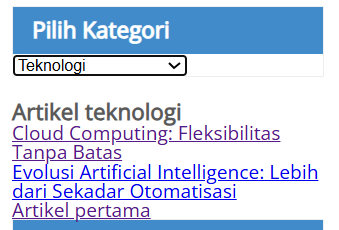
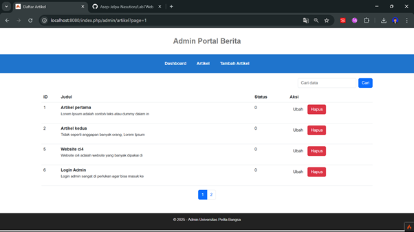

## Nama : Asep Jelpa Nasution

## Kelas : TI.23.C1

## NIM : 312310023

## Mata Kuliah : Pemrograman Web 2

## Dosen Pengampu : Agung Nugroho, S.Kom., M.Kom

## Universitas : Universitas Pelita Bangsa

## Hasil Praktikum 1: PHP Framework (Codeigniter)

## Praktikum 2: Framework Lanjutan (CRUD)

## Praktikum 3: View Layout dan View Cell

Penjelasan :
• Apa manfaat utama dari penggunaan View Layout dalam pengembangan aplikasi?

1. Konsistensi Tampilan:
   View layout membantu menjaga agar tampilan antarmuka antar halaman tetap seragam, seperti header, sidebar, dan footer.
2. Menghemat Waktu dan Usaha (DRY - Don't Repeat Yourself):
   Tidak perlu menulis ulang bagian yang sama di setiap view. Cukup ditulis sekali di layout.
3. Mudah dalam Pemeliharaan:
   Jika ingin mengubah struktur atau elemen umum halaman, cukup ubah di file layout saja.
4. Memisahkan Struktur dan Konten:
   View layout berfungsi sebagai kerangka utama, sedangkan view biasa hanya mengisi kontennya saja.

• Jelaskan perbedaan antara View Cell dan View biasa

1. View Biasa adalah file tampilan yang biasanya dipanggil dari controller menggunakan return view('nama_view'). Biasanya digunakan untuk menampilkan satu halaman penuh.
2. View Cell adalah komponen kecil yang bisa digunakan di dalam view lain dengan cara <?= view_cell('NamaClass::method') ?>. Biasanya digunakan untuk bagian tertentu yang ingin digunakan berulang kali, seperti daftar artikel terbaru, sidebar, atau widget.
3. Perbedaan utama:
   View biasa cocok untuk tampilan utama, sementara View Cell cocok untuk komponen kecil yang dinamis dan modular.

## Praktikum 4: Modul Login

---

## Praktikum 5 : Pagination dan Pencarian

## 🎯 Tujuan Praktikum

1. Memahami konsep dasar **Pagination**
2. Memahami konsep dasar **Pencarian**
3. Menerapkan pagination dan search menggunakan **CodeIgniter 4**

---

### 1. Menambahkan Pagination pada Daftar Artikel

📸 **Screenshot hasil pagination:**

---

### 2. Menambahkan Fitur Pencarian Artikel

📸 **Screenshot fitur pencarian:**

---

## 3. Pengujian Fitur

✅ Pagination muncul ketika data lebih dari 4  
✅ Fitur pencarian bekerja menampilkan hasil sesuai keyword  
✅ Pencarian dan pagination dapat berjalan bersamaan

📸 **Hasil Pengujian:**

- Tampil daftar artikel dengan paging  
  

- Tampilkan hasil pencarian  
  

- Navigasi pagination aktif  
  

---

## Praktikum 6: Upload File Gambar
## 🎯 Tujuan Praktikum

1. Memahami konsep dasar file upload.
2. Mengimplementasikan upload gambar menggunakan CodeIgniter 4.

### 1. Menambahkan Fungsi Upload pada Controller
📸 **Screenshot pengaturan method add:**

---

### 2. Tambahkan Input File pada Form Tambah Artikel
📸 **Screenshot input file:**

---

### 3. Ubah Tag Form agar Mendukung Upload File
📸 **Screenshot form dengan enctype:**

---

### 4. Uji Coba Fitur Upload Gambar

Setelah semua selesai, lakukan uji coba dengan:
- Mengisi judul dan isi artikel
- Memilih gambar
- Submit form

📸 **Screenshot hasil upload dan penyimpanan gambar:**

