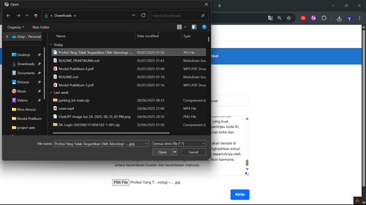
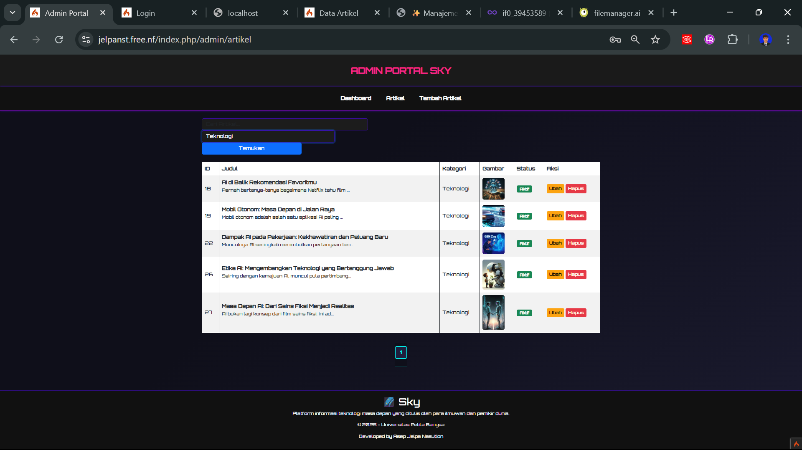

## Nama : Asep Jelpa Nasution

## Kelas : TI.23.C1

## NIM : 312310023

## Mata Kuliah : Pemrograman Web 2

## Dosen Pengampu : Agung Nugroho, S.Kom., M.Kom

## Universitas : Universitas Pelita Bangsa

## Hasil Praktikum 1: PHP Framework (Codeigniter)

## Praktikum 2: Framework Lanjutan (CRUD)

## Praktikum 3: View Layout dan View Cell

Penjelasan :
• Apa manfaat utama dari penggunaan View Layout dalam pengembangan aplikasi?

1. Konsistensi Tampilan:
   View layout membantu menjaga agar tampilan antarmuka antar halaman tetap seragam, seperti header, sidebar, dan footer.
2. Menghemat Waktu dan Usaha (DRY - Don't Repeat Yourself):
   Tidak perlu menulis ulang bagian yang sama di setiap view. Cukup ditulis sekali di layout.
3. Mudah dalam Pemeliharaan:
   Jika ingin mengubah struktur atau elemen umum halaman, cukup ubah di file layout saja.
4. Memisahkan Struktur dan Konten:
   View layout berfungsi sebagai kerangka utama, sedangkan view biasa hanya mengisi kontennya saja.

• Jelaskan perbedaan antara View Cell dan View biasa

1. View Biasa adalah file tampilan yang biasanya dipanggil dari controller menggunakan return view('nama_view'). Biasanya digunakan untuk menampilkan satu halaman penuh.
2. View Cell adalah komponen kecil yang bisa digunakan di dalam view lain dengan cara <?= view_cell('NamaClass::method') ?>. Biasanya digunakan untuk bagian tertentu yang ingin digunakan berulang kali, seperti daftar artikel terbaru, sidebar, atau widget.
3. Perbedaan utama:
   View biasa cocok untuk tampilan utama, sementara View Cell cocok untuk komponen kecil yang dinamis dan modular.

## Praktikum 4: Modul Login

---

## Praktikum 5 : Pagination dan Pencarian

## 🎯 Tujuan Praktikum

1. Memahami konsep dasar **Pagination**
2. Memahami konsep dasar **Pencarian**
3. Menerapkan pagination dan search menggunakan **CodeIgniter 4**

---

### 1. Menambahkan Pagination pada Daftar Artikel

📸 **Screenshot hasil pagination:**

---

### 2. Menambahkan Fitur Pencarian Artikel

📸 **Screenshot fitur pencarian:**

---

## 3. Pengujian Fitur

✅ Pagination muncul ketika data lebih dari 4  
✅ Fitur pencarian bekerja menampilkan hasil sesuai keyword  
✅ Pencarian dan pagination dapat berjalan bersamaan

📸 **Hasil Pengujian:**

- Tampil daftar artikel dengan paging  
  

- Tampilkan hasil pencarian  
  

- Navigasi pagination aktif  
  

---

## Praktikum 6: Upload File Gambar
## 🎯 Tujuan Praktikum

1. Memahami konsep dasar file upload.
2. Mengimplementasikan upload gambar menggunakan CodeIgniter 4.

### 1. Menambahkan Fungsi Upload pada Controller
📸 **Screenshot pengaturan method add:**

---

### 2. Tambahkan Input File pada Form Tambah Artikel
📸 **Screenshot input file:**

---

### 3. Ubah Tag Form agar Mendukung Upload File
📸 **Screenshot form dengan enctype:**

---

### 4. Uji Coba Fitur Upload Gambar

Setelah semua selesai, lakukan uji coba dengan:
- Mengisi judul dan isi artikel
- Memilih gambar
- Submit form

📸 **Screenshot hasil upload dan penyimpanan gambar:**

# Praktikum 7 - Relasi Tabel dan Query Builder

## Deskripsi
Modul ini membahas cara menghubungkan tabel artikel dan kategori menggunakan relasi One-to-Many di CodeIgniter 4, serta memanfaatkan Query Builder.

## Fitur
- Relasi One-to-Many antara artikel dan kategori.
- Tambah/Edit/Hapus artikel dengan pemilihan kategori.
- Tampilan daftar artikel dengan kategori.
- Filter dan pencarian artikel berdasarkan kategori.

## Screenshots
### Tampilan Daftar Artikel (Admin)

### Tambah Artikel

### Edit Artikel

### Tampilan Artikel di Halaman Depan

## Langkah Pengerjaan
1. Membuat tabel `kategori`
2. Menambahkan foreign key di tabel `artikel`
3. Membuat `KategoriModel`
4. Modifikasi `ArtikelModel` dan `Artikel Controller`
5. Modifikasi semua view
6. Testing fungsi: tambah, edit, hapus, filter artikel

# Praktikum 8 - AJAX dengan CodeIgniter 4

Modul ini membahas penggunaan AJAX untuk menampilkan dan menghapus data artikel tanpa reload halaman.

## 🚀 Fitur
- Menampilkan daftar artikel menggunakan AJAX
- Menghapus data artikel tanpa reload
- Mengedit data artikel tanpa reload
- Menggunakan jQuery sebagai library
- Menambahkan data artikel tanpa reload

## 📁 Struktur
- Controller: `AjaxController`
- View: `app/Views/ajax/index.php`
- Model: `ArtikelModel`
- jQuery: `public/assets/js/jquery-3.6.0.min.js`

## 📸 Screenshot
### Tabel Data Artikel

### Tombol Delete AJAX

### Tombol Edit AJAX

### Tombol +Tambah Artikel AJAX

# Modul 9 – AJAX Pagination & Search

**Nama:** Aldi Satriya  
**Kelas:** TI.23.C.1  
**Mata Kuliah:** Pemrograman Web 2  
**Universitas:** Pelita Bangsa

---

## 🎯 Tujuan Praktikum

- Menerapkan pencarian dan pagination dinamis menggunakan AJAX
- Meningkatkan UX aplikasi dengan tampilan real-time dan interaktif
- Menggunakan jQuery untuk permintaan data backend di CodeIgniter 4

---

## 🔧 Teknologi

- CodeIgniter 4
- Bootstrap 5
- jQuery 3.6+

---

## 🛠️ Langkah Pengerjaan

1. Modifikasi `admin_index()` pada controller `Artikel` untuk mendukung AJAX
2. Ubah `admin_index.php`:
   - Tambahkan form pencarian dan filter kategori
   - Tampilkan data artikel dan pagination dengan jQuery
3. Tambahkan indikator loading saat request
4. AJAX otomatis fetch data saat search dan filter berubah

---

## 🧪 Fitur yang Dibuat

| Fitur          | Status |
|----------------|--------|
| AJAX Search    | ✅     |
| AJAX Pagination| ✅     |
| Loading State  | ✅     |
| Kategori Filter| ✅     |

---

## 📸 Tampilan

| 1️⃣ | Tampilan awal halaman admin | Setelah membuka `/admin/artikel` |

| 2️⃣ | Setelah melakukan pencarian | Isi kolom search, klik "Cari" |

| 3️⃣ | Filter kategori aktif | Pilih kategori tertentu |

| 4️⃣ | Pagination AJAX berhasil | Klik halaman 2, data berubah tanpa reload |

---

# Praktikum 10 - Membuat REST API dengan CodeIgniter 4

Modul ini membahas bagaimana membuat RESTful API menggunakan CodeIgniter 4. Fokus utama adalah mengakses data artikel menggunakan metode HTTP seperti GET, POST, PUT, dan DELETE.

## 🚀 Fitur API

Menampilkan seluruh data artikel (GET /post)

Menampilkan artikel berdasarkan ID (GET /post/{id})

Menambahkan artikel baru (POST /post)

Mengubah data artikel (PUT /post/{id})

Menghapus artikel (DELETE /post/{id})

## 📁 Struktur Folder

app/
├── Controllers/
│   └── Post.php
├── Models/
│   └── PostModel.php
├── Config/
│   └── Routes.php

## ⚙️ Konfigurasi
### 1. Database
Pastikan tabel post di database memiliki kolom berikut:
CREATE TABLE `post` (
  `id` INT AUTO_INCREMENT PRIMARY KEY,
  `judul` VARCHAR(255),
  `isi` TEXT,
  `slug` VARCHAR(255),
  `status` TINYINT(1),
  `gambar` VARCHAR(255),
  `id_kategori` INT,
  `created_at` DATETIME DEFAULT CURRENT_TIMESTAMP,
  `updated_at` DATETIME DEFAULT CURRENT_TIMESTAMP ON UPDATE CURRENT_TIMESTAMP
);

### 2. Routing

Tambahkan ke app/Config/Routes.php:
$routes->resource('post');

### 3. PostModel (app/Models/PostModel.php)
namespace App\Models;

use CodeIgniter\Model;

class PostModel extends Model
{
    protected $table = 'post';
    protected $primaryKey = 'id';
    protected $allowedFields = ['judul', 'isi', 'slug', 'status', 'gambar', 'id_kategori'];
    protected $useTimestamps = true;
    protected $createdField  = 'created_at';
    protected $updatedField  = 'updated_at';
    protected $returnType = 'array';
}

### 4. Post Controller (app/Controllers/Post.php)
namespace App\Controllers;

use CodeIgniter\RESTful\ResourceController;
use App\Models\PostModel;

class Post extends ResourceController
{
    protected $model;

    public function __construct()
    {
        $this->model = new PostModel();
    }

    public function index()
    {
        return $this->respond(['status' => 200, 'data' => $this->model->findAll()]);
    }

    public function create()
    {
        $data = $this->request->getPost() ?: $this->request->getJSON(true);

        if (!isset($data['judul']) || !isset($data['isi'])) {
            return $this->failValidationErrors('Judul dan isi wajib diisi.');
        }

        $data['slug'] = url_title($data['judul'], '-', true);
        $this->model->insert($data);

        return $this->respondCreated(['status' => 201, 'messages' => ['success' => 'Artikel ditambahkan.']]);
    }

    public function show($id = null)
    {
        $data = $this->model->find($id);
        return $data ? $this->respond($data) : $this->failNotFound('Data tidak ditemukan.');
    }

    public function update($id = null)
    {
        if (!$this->model->find($id)) return $this->failNotFound('Data tidak ditemukan.');

        $data = $this->request->getRawInput();
        if (!isset($data['judul']) || !isset($data['isi'])) {
            return $this->failValidationErrors('Judul dan isi wajib diisi.');
        }

        $data['slug'] = url_title($data['judul'], '-', true);
        $this->model->update($id, $data);

        return $this->respond(['status' => 200, 'messages' => ['success' => 'Artikel berhasil diupdate.']]);
    }

    public function delete($id = null)
    {
        if (!$this->model->find($id)) return $this->failNotFound('Data tidak ditemukan.');

        $this->model->delete($id);
        return $this->respondDeleted(['status' => 200, 'messages' => ['success' => 'Artikel berhasil dihapus.']]);
    }
}

## 🔧 Pengujian API
Gunakan Postman atau REST client lainnya.

GET http://localhost:8080/post

GET http://localhost:8080/post/{id}

POST http://localhost:8080/post (form-data: judul, isi, id_kategori)

PUT http://localhost:8080/post/{id} (raw/json: judul, isi, id_kategori)

DELETE http://localhost:8080/post/{id}

AjaxController.php
ArtikelModel.php
Views/ajax/index.php
iews/ajax/artikel_list.php
app/Views/pagers/bootstrap.php

Updatedate

